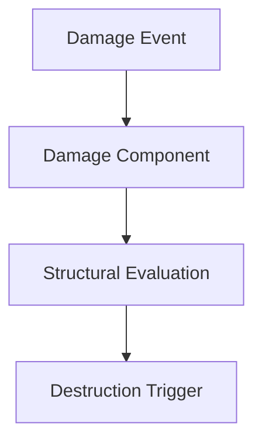

# Architecture Note - System Name

## Purpose
What problem does this system solve?

## Responsibilities
- 

## Inputs
- 

## Outputs
- 

## Unreal Classes / Components
- 

## Data Flow

## Multiplayer Considerations

## Performance Considerations

## Dissertation Notes
